# ChartPilot — Pre-Clinic Chart-Prep Agent

<p align="center">
  <em>The night before clinic, ChartPilot reads the whole chart and prepares a one-page safety brief —<br/>
  where deterministic code owns every fact, a second AI tries to prove each finding wrong, and the gate fails closed.</em>
</p>

<p align="center">
  <a href="https://chartpilot-frontend-zkhsg5lcca-el.a.run.app"><b>▶ Live demo</b></a> &nbsp;·&nbsp;
  <a href="https://youtu.be/wKAX3P97Ye0"><b>🎬 Watch the 4-min video</b></a> &nbsp;·&nbsp;
  <a href="https://github.com/kayomarz97/chartpilot"><b>💻 Source</b></a>
</p>

<p align="center">
  
  
  
  
  
  
  <a href="https://github.com/kayomarz97/chartpilot/actions/workflows/ci.yml"></a>
</p>

> **⚠️ Synthetic data only. Not a medical device. Not clinically validated. Not for clinical use.**
> ChartPilot is a hackathon prototype (All Things Agentic, Taskmaster track). It runs entirely on
> hand-authored **synthetic** FHIR data and makes **no** claim of clinical validation, regulatory
> approval, HIPAA compliance, or production readiness.

---

## 🧭 Judges — start here

**In one line:** an autonomous agent that, the night before clinic, reads a patient's *entire* FHIR
record and produces a one-page safety brief — a full nightly **workflow**, not a chatbot.

This project is scored on three axes; here is exactly where each one lives in the repo:

| Judging criterion | Where to look in this repo |
|---|---|
| **Innovation & Operational Utility — 40%** <br/>_autonomous, high-value action_ | [What it does](#30-second-version-plain-language) · [Why this should win](#-why-this-should-win-mapped-to-the-judging-criteria) — a self-driving nightly pipeline that fetches, computes, retrieves evidence, reasons, self-checks with a second model, and persists, then hands a ranked one-page brief to the clinician. |
| **Architectural Discipline & Tech Stack — 30%** <br/>_decoupling · credential security · failure handling_ | [How it works](#how-it-works) · [Safety design](#safety-design-why-you-can-trust-a-finding) · [The deployed system](#the-deployed-system-the-backend-made-visible) — deterministic layer owns every fact, **fails closed**, least-privilege service accounts, secrets in Secret Manager, durable idempotent orchestration. |
| **Demo & Production Readiness — 30%** <br/>_video · docs · diagram · reproducible setup · GCP proof_ | [4-min video](#-watch-it-in-4-minutes) · [Live demo ↗](https://chartpilot-frontend-zkhsg5lcca-el.a.run.app) · [See it in action](#-see-it-in-action) · [Deployed on Google Cloud — the proof](#-deployed-on-google-cloud--the-proof) · [Run it in 60 seconds](#-run-it-in-60-seconds) |

### ⚡ Run it in 60 seconds

The full verification gate is **hermetic** — no cloud, no network, no API key:

```bash
git clone https://github.com/kayomarz97/chartpilot && cd chartpilot
cd backend && uv sync && cd ..          # install backend deps (Python 3.11 + uv)
make check                              # ruff + mypy(strict) + 452 network-blocked tests + secret scan
```

Want the live UI instead? It's already deployed — just open the
**[live demo ↗](https://chartpilot-frontend-zkhsg5lcca-el.a.run.app)**. Full run/deploy details in
[Running it](#running-it).

---

<p align="center">
  <a href="docs/images/diagram-doctor-view.png">
    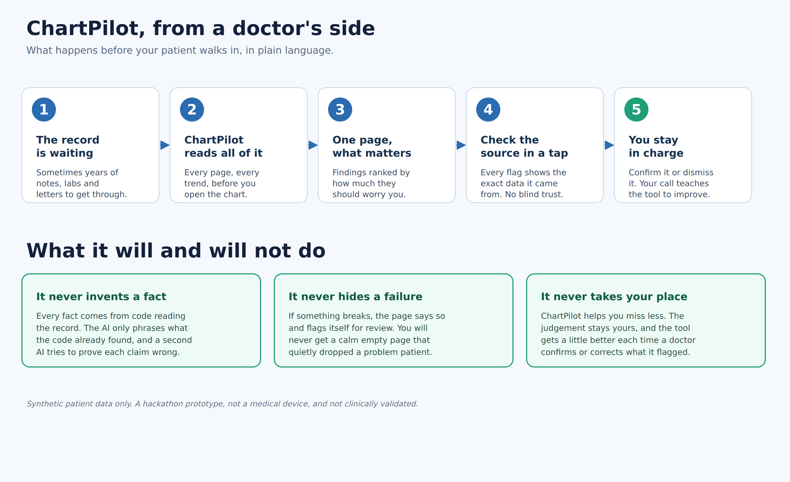
  </a>
</p>

---

## 🎬 Watch it in ~4 minutes

<p align="center">
  <a href="https://youtu.be/wKAX3P97Ye0">
    
  </a>
  <br/>
  <a href="https://youtu.be/wKAX3P97Ye0"><b>▶ ChartPilot — full walkthrough (YouTube)</b></a>
</p>

---

## 30-second version (plain language)

Before a clinic visit, a doctor has a couple of minutes to skim a patient's chart, and it is easy to
miss something that matters: a dangerously high potassium in someone on a blood-pressure drug that
pushes potassium higher, a lab trend nobody followed up. **ChartPilot reads the whole chart the night
before and prepares a one-page safety brief**, and, crucially, it *shows its work*: every point it
raises comes with the exact source it is based on, and a **second AI** has already tried to prove that
point wrong before you ever see it. If anything is uncertain, it says so and hands it to the clinician.
It never quietly makes something up, and it never hides a failure behind "nothing found."

## The thesis (technical)

Most "AI + health" demos are `FHIR → LLM → advice`. That is exactly the pattern you must **not** ship in
medicine. ChartPilot implements a safer one:

> **FHIR facts + deterministic clinical computation + current medical evidence + patient-history
> reasoning + independent adversarial verification + clinician review**, *not* `FHIR → LLM → advice`.

Deterministic code owns every fact; the LLM is only an *editor/synthesizer*; an evidence + citation layer
forbids unsupported claims; a **blinded** second model tries to break the first's claims; and a final gate
**fails closed**: an unproven claim can never be shown as verified. **The clinician remains the
decision-maker.**

---

## 🏆 Why this should win (mapped to the judging criteria)

### Innovation & Operational Utility — the 40%
- **A full agentic *workflow*, not a chatbot.** Unprompted, ChartPilot fetches the record, computes clinical
  facts, retrieves current evidence, drafts findings, self-checks with a *second* model, and persists a
  ranked one-page brief — the "Taskmaster" ideal of an agent that handles the details and puts the right
  information in front of the right person.
- **It removes real clinical friction on its own.** A doctor has ~2 minutes to skim a chart; ChartPilot does
  the reading the night before and surfaces the one thing that matters (e.g. a rising potassium on an ACE
  inhibitor in a patient with declining renal function) — *with its receipts*.

### Architectural Discipline & Tech Stack — the 30%
- **Safety is structural, not vibes.** Deterministic code owns every fact; the LLM is only an editor; a
  **blinded** Model B tries to *falsify* each claim; a final gate **fails closed**. A byte-equal
  prompt-injection invariant test proves free text can never alter a fact, a rule, or a gate.
- **Credential security & least privilege by design.** Two separate service accounts (a runtime identity vs.
  an invoke-only identity), the Gemini key in **Secret Manager**, a private OIDC-only backend, all infra
  hard-pinned to an isolated GCP project. Failures are durable statuses (`FAILED`/`FLAGGED_FOR_REVIEW`),
  **never** a silent "no findings."
- **Measured, not asserted.** Model B was tested against a corruption suite, found **over-aggressive**
  (75% false-reject), and is therefore shipped **ADVISORY with the badge withheld** — we refused to re-tune
  it against its own test set to fake a better number. Honest measurement *is* the discipline.

### Demo & Production Readiness — the 30%
- **Fully deployed, end-to-end, on real Google Cloud** — Scheduler → Cloud Tasks → private Cloud Run →
  **real Gemini** → Firestore → a public UI that reads the **real** results back ([console proof below](#-deployed-on-google-cloud--the-proof)). Not a mock.
- **Reproducible in one command** ([Run it in 60 seconds](#-run-it-in-60-seconds)): a hermetic `make check`
  gate (452 network-blocked tests) plus green CI, a clear architecture diagram, a 4-min demo video, and a
  live URL judges can click right now.
- **Radical transparency about scope.** Synthetic data, US-label jurisdiction, ADVISORY review, variable
  latency — all stated up front. Integrity reads as strength, not weakness.

---

## 🔁 Reused-work disclosure (hackathon rule)

Per the rule *"Projects must be newly created during the Submission Period … but must disclose any other
pre-existing code or work incorporated,"* ChartPilot reuses **design patterns and knowledge** from the
author's existing **Iatronix** platform (`github.com/kayomarz97/iatronix`, med.kayomarz.com):
specifically the evidence-first "LLM as editor, never source of facts" philosophy, NCBI/openFDA throttling
patterns, and the grounding/citation-registry concepts. **The ChartPilot codebase (FHIR normalization,
ClinicalValidityEngine, deterministic rules, citation verifier, blinded Model-B harness + corruption
suite, durable orchestration, two-phase Firestore commit, and the entire UI) was written new during the
submission period.** See `ATTRIBUTION.md` for the authoritative per-component ledger.

---

## How it works

<p align="center">
  <a href="docs/images/diagram-architecture.png">
    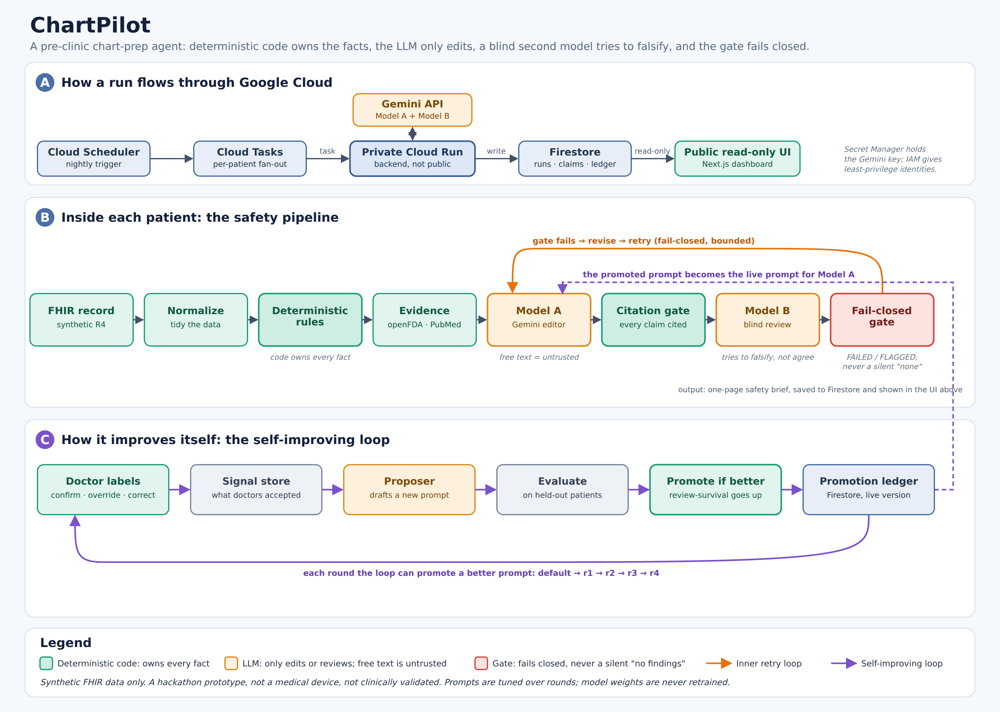
  </a>
  <br/>
  <sub><i>The whole system on one page: the cloud run (A), the per-patient safety pipeline (B), and the self-improving loop (C). Click to enlarge.</i></sub>
</p>

### In plain language, step by step
1. **Read the chart.** Pull the patient's longitudinal FHIR record (labs, meds, diagnoses, allergies).
2. **Turn it into clean facts.** Convert units, resolve which lab result is the current one, handle dates
   and time zones precisely, deterministically, in code.
3. **Apply clinical rules.** Run checks a careful clinician would (e.g. "high potassium in someone on a
   drug that raises potassium"), plus kidney-function math (eGFR).
4. **Gather current evidence.** Pull the relevant drug-label facts and published literature/guideline
   citations, and freeze an exact, tamper-evident copy.
5. **Let the AI draft findings.** Model A writes each finding *with the exact quote* from the evidence it
   relied on.
6. **Check every quote automatically.** Code verifies the quote really exists in the real source, at the
   offsets *we* computed, never offsets the model claimed.
7. **Have a second AI attack it.** A blinded Model B (which never sees Model A's reasoning) tries to prove
   each finding wrong.
8. **Refuse to pass anything unproven.** A final gate decides the verdict; disagreement → human review;
   pending-review guidance can only ever be "partially verified."
9. **Save it durably and show it.** Results are written to the database and rendered in the dashboard,
   alongside a **manual-review panel** (history + lab trends) so the clinician can cross-check the AI.

### Component flow (what runs, in order)

```mermaid
flowchart LR
  SCHED[Cloud Scheduler<br/>nightly · Asia/Kolkata] --> ENQ[Cloud Run<br/>POST /enqueue-run]
  ENQ --> TASKS[Cloud Tasks<br/>1 task / patient · idempotent]
  TASKS --> WORK[Cloud Run<br/>POST /tasks/process-patient]
  WORK --> P
  subgraph P[Per-patient pipeline · run_patient · fail-closed + checkpointed]
    direction TB
    A[FETCH<br/>FHIR read] --> B[NORMALIZE<br/>units · status/supersession · UTC+precision]
    B --> C[RULES + ClinicalValidityEngine<br/>K_HIGH_RISK_001 · eGFR CKD-EPI 2021]
    C --> D[EVIDENCE<br/>openFDA labels · PubMed literature ·<br/>PubMed guideline citations · immutable snapshot]
    D --> E[MODEL A · Gemini 3.7-flash<br/>structured claims + verbatim spans]
    E --> F[CITATION GATES 1-4<br/>source exists → hash → span found → tier/type]
    F --> G[MODEL B · Gemini 3.5-flash<br/>BLINDED · tries to falsify]
    G --> H[FINAL GATE<br/>claim verdicts · patient state · fail-closed]
  end
  H --> FS[(Firestore<br/>two-phase commit · claims/evidence · presentation read-model)]
  FS --> READ[Cloud Run<br/>GET /runs/&#123;id&#125; · public read-only]
  READ --> UI[Next.js UI · public<br/>dashboard · evidence drawer · manual-review panel]
```

### One run, as a sequence (who calls whom)


### Per-stage technical detail
| Stage | What it does | Why it's safe |
|---|---|---|
| **Normalize** | UCUM units via `Decimal`; observation status + supersession; UTC + precision-aware temporal engine (Asia/Kolkata display). | Facts are computed, not parsed by an LLM. |
| **Rules + validity** | `K_HIGH_RISK_001`; eGFR (CKD-EPI 2021), corrected calcium, anion gap via a `ClinicalValidityEngine`. | Deterministic; returns `INSUFFICIENT_DATA`/`INVALID` instead of guessing. |
| **Evidence** | openFDA SPL selection (§14), PubMed E-utilities literature, **PubMed guideline-publication-type citations** (see below); token-bucket throttle; immutable **content-hashed** snapshot. | Evidence is frozen and hash-verified; no live drift mid-run. |
| **Model A** | Gemini `3.7-flash` via the Interactions API; emits structured claims each carrying a **verbatim span**. | The model proposes; it does not get to assert facts without a quote. |
| **Citation gates 1-4** | source exists → content-hash matches → span really present → claim-type/tier consistent. **Offsets computed by us.** | A hallucinated or mis-attributed quote cannot pass. |
| **Model B** | Gemini `3.5-flash`, **blinded** (no Model-A rationale/confidence), gets the evidence *region*, tries to **falsify**. | Independent adversary; §22 corruption suite measures it. |
| **Final gate** | claim verdicts + orthogonal patient status/stage; A/B disagreement → review; PENDING guideline caps at PARTIALLY_VERIFIED. | **Fails closed:** unproven ⇒ never `VERIFIED`. |
| **Persist + read** | two-phase Firestore commit (§45A) of claims/evidence + a public **presentation** read-model. | Durable, idempotent; a failure is a status, never silence. |

---

## Safety design (why you can trust a finding)
1. **Deterministic layer owns the facts.** Free text is `trusted=False` and can never change a normalized
   fact, a rule, or a gate (`SPEC §53`; a byte-equal prompt-injection invariant test proves it).
2. **Every external claim carries a verbatim span**, verified by deterministic gates. Offsets are computed
   by us, never trusted from the model.
3. **A blinded second model** tries to *falsify* each claim; it never sees Model A's rationale/confidence.
4. **A final gate fails closed:** a claim that fails any gate can never be `VERIFIED`, even if Model B
   accepts it; disagreement → human review; PENDING guidance caps at `PARTIALLY_VERIFIED`.
5. **Durable + idempotent** per-patient execution with checkpoint/resume, budgets → `TIMED_OUT`, and
   dead-lettering; a failure surfaces as `FAILED`/`FLAGGED_FOR_REVIEW`, **never** "no findings."

The UI reinforces this: findings sit next to a **collapsible manual-review panel** (patient history +
recent labs with inline trend sparklines), and the one deliberately-failed demo patient is shown under a
labelled **"Safety demonstration"** so a reviewer can see exactly how failures surface.

---

## 🖥️ See it in action

**The queue — one card per patient, with the failure case shown on purpose.** Flagged, completed, and a
deliberately-failed chart under a labelled *"Safety demonstration"*: ChartPilot never falls back to a
silent empty page that could be mistaken for a clean chart.

<p align="center">
  <a href="docs/images/frontend-01-patient-queue-desktop.png">
    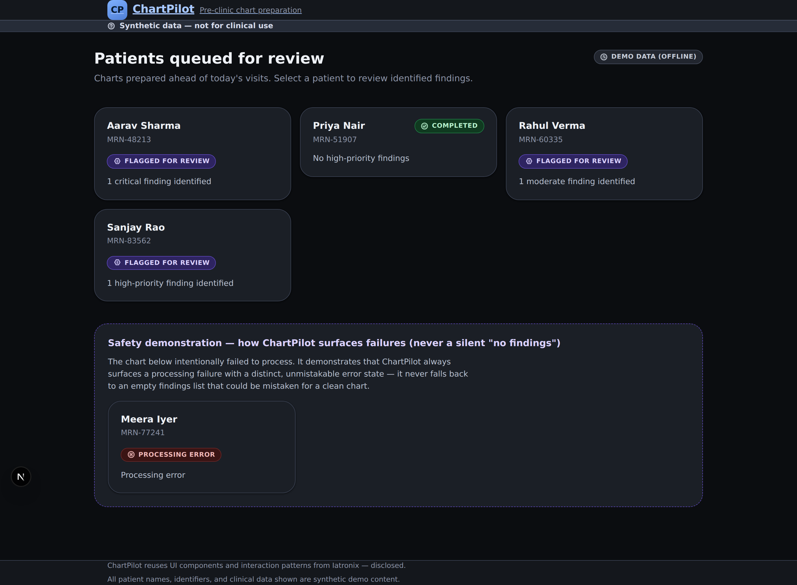
  </a>
</p>

**A finding — never a claim without its receipt.** Every finding carries a plain-language rationale, a
recommended action, and the exact chart evidence it was built from (labs with dates and reference ranges,
active meds, active diagnoses), plus one-tap *Confirm / Override / Correct* clinician controls.

<p align="center">
  <a href="docs/images/frontend-02-patient-flagged-aarav.png">
    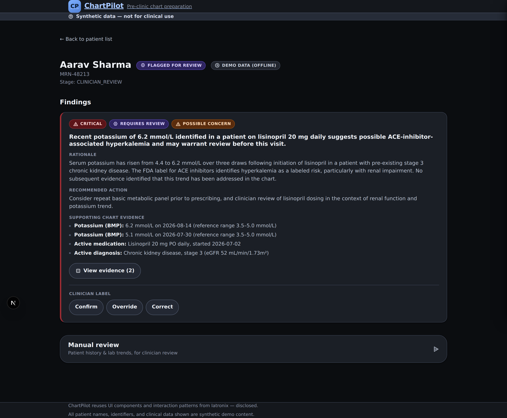
  </a>
</p>

**The evidence drawer — click "View evidence" and see the source itself.** The verbatim FDA-label span,
the snapshot ID and source URL, the *computed* character offsets (never the ones the model claimed), a
green row of deterministic citation checks, and the blinded Model-B cross-check verdict.

<p align="center">
  <a href="docs/images/frontend-07-evidence-drawer.png">
    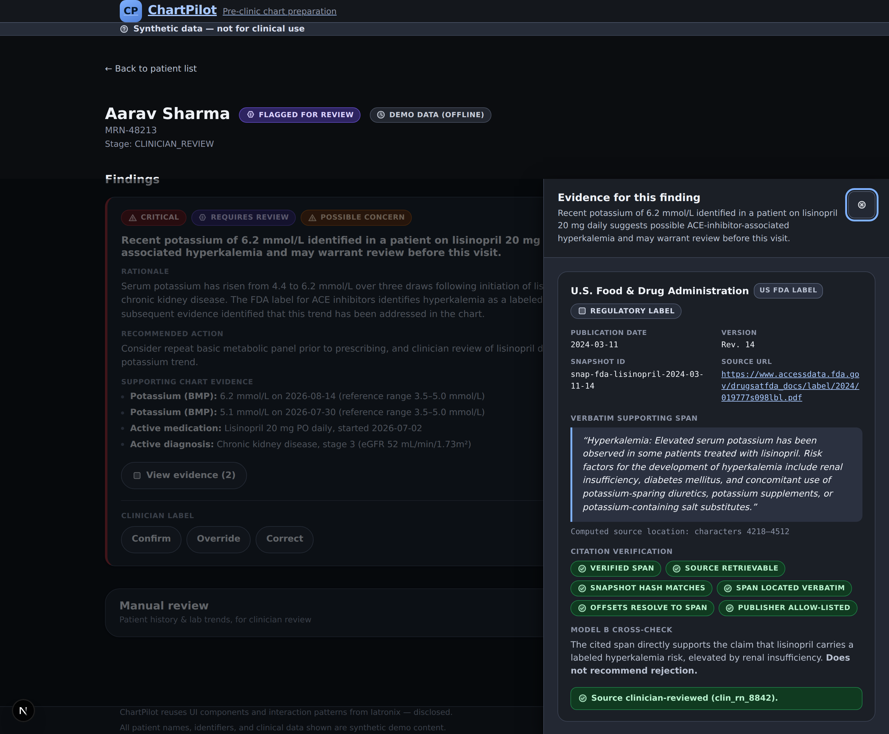
  </a>
</p>

**The manual-review panel — the doctor's own cross-check.** A full longitudinal timeline (labs, meds,
diagnoses, safety signals) and recent labs with inline trend sparklines, so the clinician can verify the
AI against the raw record without leaving the page.

<p align="center">
  <a href="docs/images/frontend-08-review-panel.png">
    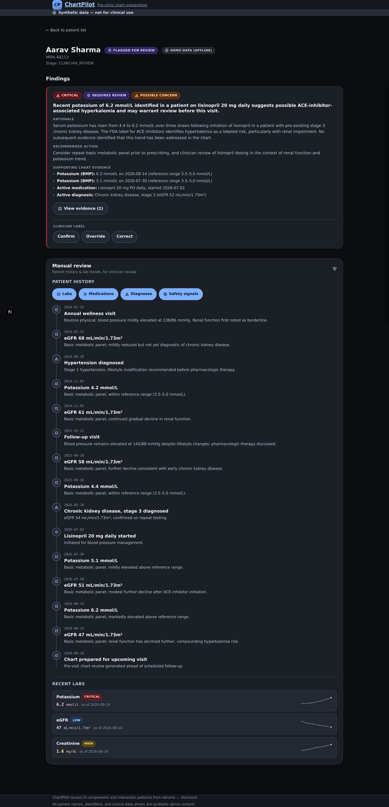
  </a>
</p>

<details>
<summary><b>More screenshots</b> — completed & error states, and the mobile layout</summary>

<br/>

| Completed (no high-priority findings) | Safety demonstration (processing error) |
|---|---|
| [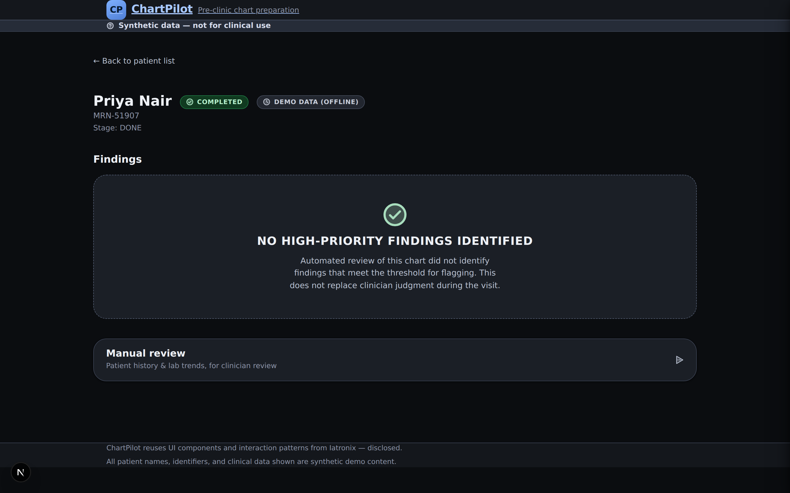](docs/images/frontend-03-patient-completed.png) | [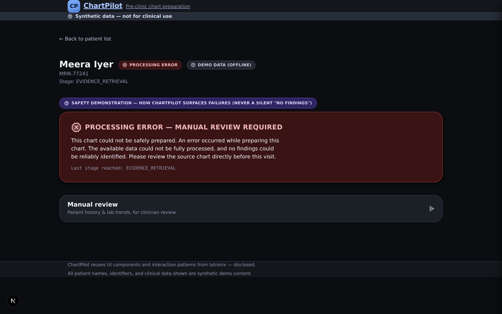](docs/images/frontend-04-patient-error-state.png) |

| Queue (mobile) | Patient detail (mobile) |
|---|---|
| [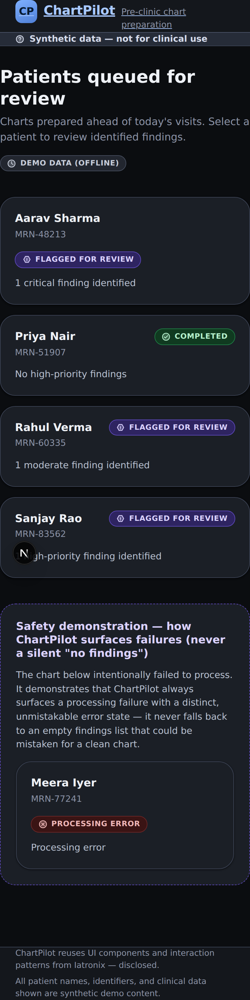](docs/images/frontend-05-patient-queue-mobile.png) | [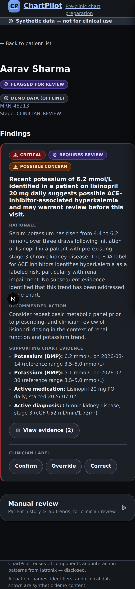](docs/images/frontend-06-patient-detail-mobile.png) |

</details>

---

## The deployed system (the backend, made visible)

Two Cloud Run services in the **isolated** GCP project `chartpilot-agentic` (`asia-south1`):

- **`chartpilot-api`**: private, `--no-allow-unauthenticated`. Runs the pipeline (Scheduler/Tasks call it
  with Google-signed **OIDC**), writes to Firestore, reads the Gemini key from **Secret Manager**. Exposes
  one **public, read-only** endpoint, `GET /runs/{run_id}`, that serves the *real* persisted run results.
- **`chartpilot-frontend`**: public. The Next.js dashboard fetches `GET /runs/{run_id}` and renders the
  **actual AI output** from the live pipeline (with graceful fallback to a bundled demo run if the backend
  is unreachable, so the site is never broken).

**Least privilege (`SPEC §73`):** two separate service accounts: a *runtime* identity that touches
Firestore + the secret, and an *invoker* identity that may only *call* the service. A leaked
Scheduler/Tasks config can trigger the service but never read patient data directly. All infra is scripted
(`infra/`), idempotent, and hard-pinned to `--project=chartpilot-agentic` (existing projects, incl.
Iatronix, are provably never touched).

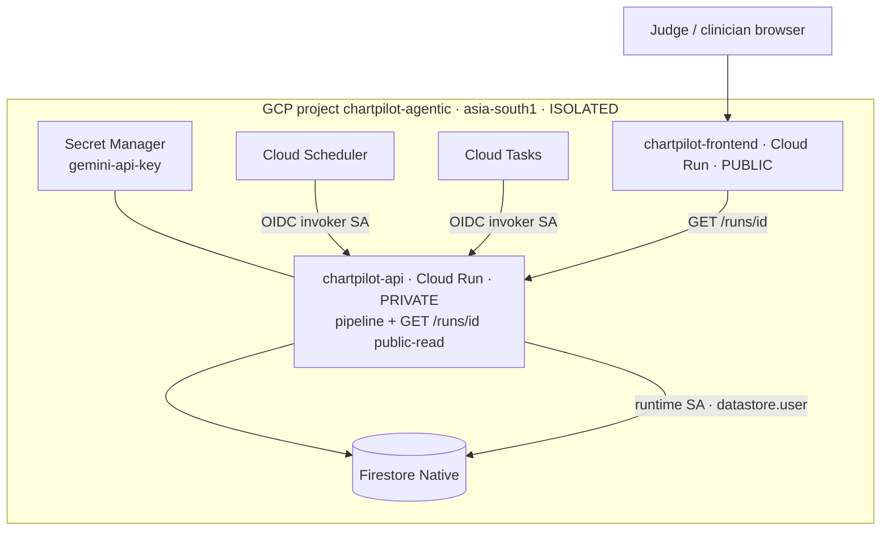

### ☁️ Deployed on Google Cloud — the proof

Not a claim — the live GCP console for the isolated `chartpilot-agentic` project (`asia-south1`). Both
Cloud Run services are up, the nightly Scheduler job's last execution **succeeded**, the per-patient Cloud
Tasks queue exists, and Firestore holds the **real** persisted run documents the public UI reads back.

| Cloud Run — two live services | Cloud Scheduler — nightly job, last run ✅ |
|---|---|
| [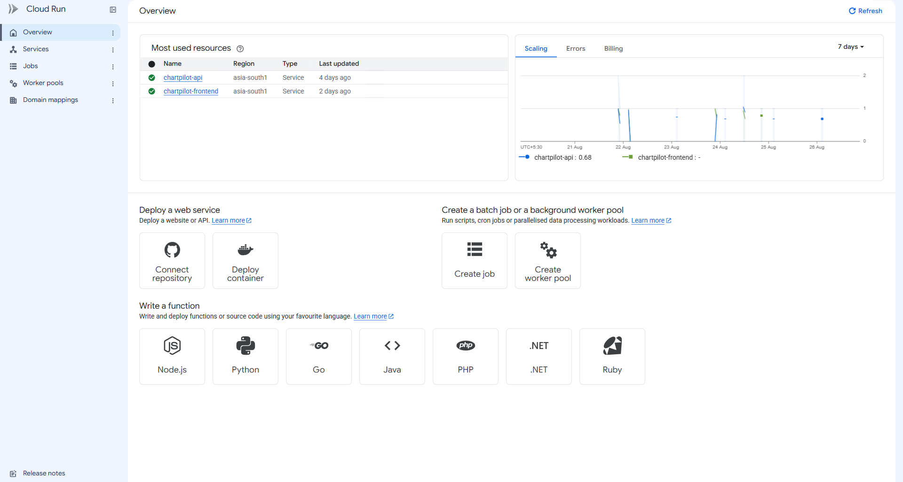](docs/images/gcp/01_cloud_run.png) | [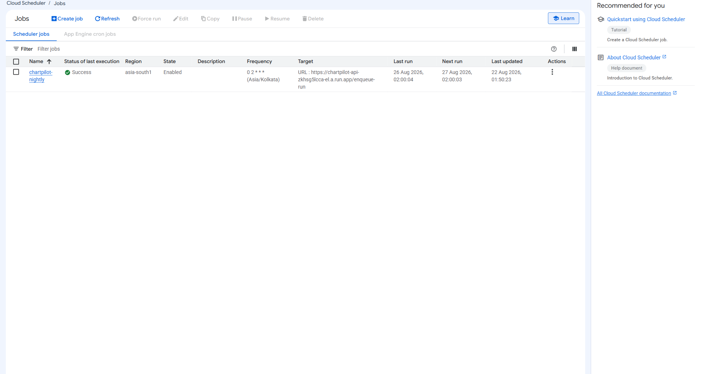](docs/images/gcp/06_cloud_scheduler.png) |

| Cloud Tasks — per-patient queue | Firestore — real persisted run documents |
|---|---|
| [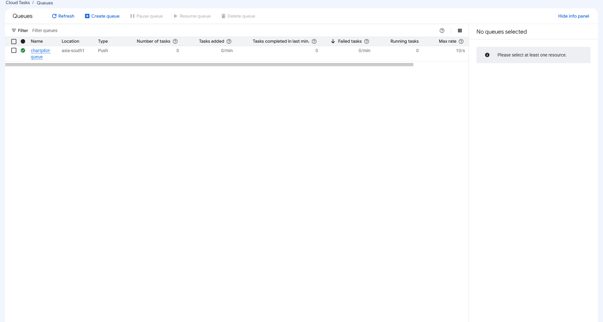](docs/images/gcp/05_cloud_tasks.png) | [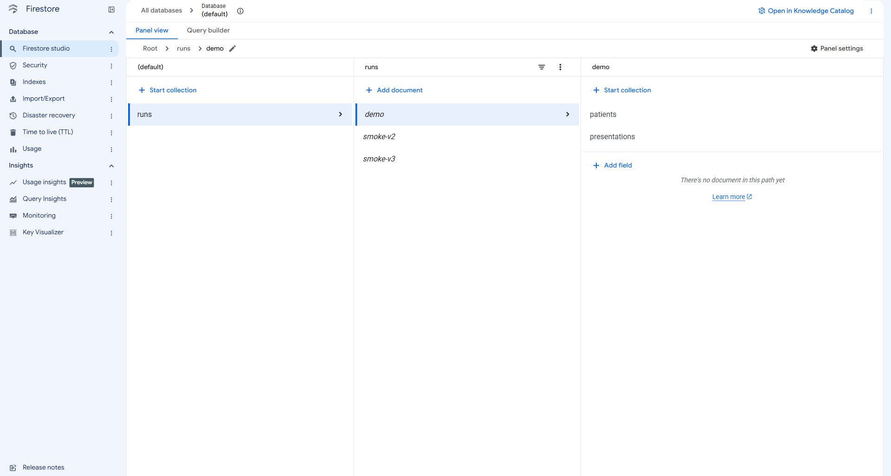](docs/images/gcp/07_firestore.png) |

All of this is reproducible from the ordered, idempotent scripts in [`infra/`](infra/), hard-pinned to
`--project=chartpilot-agentic` so no other project (including the author's Iatronix) is ever touched.

---

## 🤖 Built with AI agents, to make better AI agents, and the work is visible

This project was **built by an AI-agent workflow, on purpose, and the entire process is auditable in the
repo**, fitting for an "All Things Agentic" submission. The meta-point: *disciplined agent orchestration
can produce safety-critical software you can actually trust, because the process leaves evidence.*

- **Two-tier agent operating model** (`TECHNICAL_DECISIONS.md` TD-009): a planning/verifying orchestrator
  agent writes the brief and **independently re-verifies** every result; builder agents implement.
  Builders never commit. The orchestrator does, only after re-running the checks.
- **A 20-phase build protocol with machine-checkable gates** (`SPEC §64/§65`): each phase ends only when
  `make check` (formatter + linter + `mypy --strict` + a **network-blocked** test suite + a secret
  scanner + a no-sampling-params gate) exits 0, its output is teed to `evidence/phase_NN.txt` (with git
  SHA + UTC), a dated `journal.md` entry exists, and an annotated `git tag phase-NN` is cut. **The tag is
  the recovery unit.** No artifact, no completion.
- **A persistent decision log.** `journal.md` (build log + every mistake and its fix) and
  `TECHNICAL_DECISIONS.md` (TD-001…TD-013) mean nothing is folklore: every non-obvious choice is written
  down with its rationale.
- **The process caught real bugs.** Two production bugs were invisible to the offline suite and only
  surfaced on the live deploy (a missing `Content-Type` on Cloud Tasks payloads; three missing Cloud Tasks
  OIDC IAM grants). Both were fixed **and folded back into reproducible scripts**: the audit trail shows
  exactly how.

**Want to inspect the work?** `git tag -l 'phase-*'` (checkpoints), `evidence/phase_*.txt` (the gate
output for each), `journal.md` (the narrative + mistakes ledger), and `TECHNICAL_DECISIONS.md` (the why).

---

## Evidence & guidelines (and an honest note on PubMed)

- **openFDA** drug labels (US-FDA jurisdiction only), selected per §14.
- **PubMed E-utilities** literature: abstracts, **literature-tier**, never presented as a guideline.
- **PubMed guideline-publication-type citations (TD-012).** PubMed does **not** provide licensed guideline
  *text*; it indexes citations, **including to guideline publications** (publication type `Guideline`).
  ChartPilot queries that filter and surfaces the resulting **citations** (title, journal, year, PMID,
  link + abstract) as `GUIDELINE`-tier evidence marked `reviewed_by: PENDING`. Because the gate caps any
  PENDING guideline at `PARTIALLY_VERIFIED`, such a citation can **never alone** make a claim `VERIFIED`,
  and no guideline body text is copied (licensing-safe).

---

## Measured results (see `EVALUATION.md`)
- **Single-patient live latency:** ≤ 90 s is **achievable but NOT reliably met**: one session ~44-58 s
  (met), another ~125-193 s (not met), dominated by the Model A call under load. The judged demo uses a
  precomputed run (instant); the live path is real but latency-variable. Levers noted in `EVALUATION.md`.
- **Deterministic corruption blocking (Set D):** 7/7 (100%) blocked before Model B.
- **Model B model-only corruptions (Set M):** 8/8 (100%), 0 false-accept.
- **Model B specificity:** control false-reject **75% (3/4)**: over the ≤20% ceiling ⇒ **§22.3 threshold
  NOT met ⇒ the "independent review ✓" badge is WITHHELD; Model B verdicts show as ADVISORY only.** The
  deterministic gates remain the authoritative safety layer. We deliberately did **not** re-tune Model B
  against its own suite to inflate the number.
- **Self-improving loop: live 4-round physician-in-the-loop run (2026-08-23).** 4 rounds × 8 **new**
  synthetic patients each (32 total), all real Gemini. Every round the loop proposed a Model-A prompt
  revision and **promoted it only after it beat the prior prompt on a held-out benchmark** (the patients the
  prior prompt handled *worst*), requiring **strict improvement AND zero citation-quality regression**.
  Result: a promotion every round (default → r1 → r2 → r3 → r4):

  | Round | Prompt scored | Held-out **review-survival** (baseline → candidate) | Blinded **Model-B support** on that round's *fresh* patients | Citation verified-span |
  |---|---|---|---|---|
  | 1 | default → r1 | 50.0% → 55.6% | 50% (7/14) | 100% |
  | 2 | r1 → r2 | 28.6% → 33.3% | 44% (7/16) | 100% |
  | 3 | r2 → r3 | 33.3% → 40.0% | 54% (7/13) | 100% |
  | 4 | r3 → r4 | 42.9% → **80.0%** | **79% (11/14)** | 100% |

  **What actually improved:** finding *quality*: the fraction of cited findings that survive both the
  deterministic gate and the blinded Model B. On each round's fresh unseen patients the Model-B support rate
  moved **50% (default prompt) → 79% (round-3 prompt)**, while the deterministic **citation verified-span rate
  held at 100% throughout** (the loop never traded quoting accuracy for it). The loop learned chiefly from the
  physician's repeated *overrides of generic guideline boilerplate on normal-potassium patients*: every
  promoted prompt tightened grounding for guideline/inference claims. **It never touched a clinical rule, the
  eGFR/validity math, or the fail-closed gate: those are structurally forbidden targets** (`app/improve`).
  *Honest limits:* one clinical domain (hyperkalemia + ACE-inhibitor), single vendor, synthetic patients,
  small per-round benchmarks (so rates are coarse and the cross-round trend is noisy, round 2 dipped on
  harder patients), no independent holdout, and the loop did **not** fully eliminate the normal-K guideline
  boilerplate (the physician still overrode 2-3 findings every round). This is *not* the same number as the
  75% Model-B false-reject above: that control measurement stands unchanged; the loop improves a
  complementary axis (Model-A finding quality), and we did not re-tune Model B against its own suite.
  *Honest note on the run:* this four-round live run was interrupted once, after round 1, when the
  project's Gemini monthly spend cap tripped. The cap was raised and the remaining rounds completed; all
  four rounds ran on live Gemini. The pause was a billing limit, not a pipeline failure. Full detail in
  `EVALUATION.md`.
- **Accessibility:** automated axe pass (0 serious/critical); manual keyboard + greyscale pass pending.

---

## Honest scope & limitations (`SPEC §79`)
- **Synthetic data only**; no real PHI. Demo patients are hand-authored regression fixtures with realistic
  multi-year histories, **not** a statistically valid benchmark, and there is **no independent holdout**.
- **Two-model review is single-vendor** (both Gemini), weaker than cross-vendor "independence,"
  compensated by stronger deterministic gates + the measured corruption suite, and currently shipped
  **ADVISORY**.
- **US-label jurisdiction only.** Guideline citations are PENDING clinician review by construction.
- **Not clinically validated. Not a medical device. Not production-ready.**

---

## Running it

**Backend (hermetic, no network, no key needed):**
```bash
cd backend && uv sync
cd .. && make check           # ruff + mypy(strict) + pytest(network-blocked) + secret-scan + sampling-param gate
```
**Frontend:**
```bash
cd frontend && pnpm install && pnpm run build && pnpm test   # production build + axe a11y
```
**Live single-patient path (costs real Gemini tokens):** put `GEMINI_API_KEY=...` in `backend/.env`
(gitignored), then `make live-test`. **Deploy (isolated GCP project):** the ordered, idempotent scripts in
`infra/` (see `infra/README.md`). Nothing runs against your cloud until you run them.

## Repository docs
`EVALUATION.md` (measured results) · `TECHNICAL_DECISIONS.md` (TD-001…013) · `ATTRIBUTION.md` (reuse ledger)
· `SUBMISSION.md` (Devpost content) · `CONTRIBUTING.md` (how to run the gate) · `LICENSE` (MIT) ·
`journal.md` (build log + mistakes ledger) · `evidence/phase_*.txt` (per-phase machine-checked gates) ·
`infra/` (reproducible deploy) · `git tag -l 'phase-*'` (recovery checkpoints).

> A note on references: markers like `§53` or `SPEC §22` throughout these docs point to sections of the
> internal build specification. The team keeps that spec in its private working notes rather than in the
> public repo, so treat the section numbers as internal citations, not links.
