# ChartPilot — Pre-Clinic Chart-Prep Agent

> **⚠️ Synthetic data only. Not a medical device. Not clinically validated. Not for clinical use.**
> ChartPilot is a hackathon prototype (All Things Agentic, Taskmaster track). It runs entirely on
> hand-authored **synthetic** FHIR data and makes **no** claim of clinical validation, regulatory
> approval, HIPAA compliance, or production readiness.

ChartPilot autonomously prepares a clinician-facing **pre-visit safety brief** from longitudinal FHIR R4
data — surfacing things a doctor could miss in a fast chart review (e.g. a critical potassium in a patient
on an ACE inhibitor) — and **shows verifiable evidence for every finding**, with an independent second
model that tries to disprove each finding before it is presented.

The guiding principle (see `SPEC.md §85`):
**FHIR facts + deterministic clinical computation + current medical evidence + patient-history reasoning +
independent adversarial verification + clinician review** — *not* `FHIR → LLM → medical advice`. The LLM
provides contextual synthesis; deterministic code owns the facts; the evidence + citation layers prevent
unsupported claims; a second model tries to break the first's claims; a final gate refuses to pass
unsupported claims. **The clinician remains the decision-maker.**

---

## 🔁 Reused work disclosure (hackathon rule)

Per the hackathon rule *"Projects must be newly created during the Submission Period … but must disclose
any other pre-existing code or work incorporated,"* this project reuses **design patterns and knowledge**
from the author's existing **Iatronix** platform (`github.com/kayomarz97/iatronix`, med.kayomarz.com) —
specifically the evidence-first "LLM as editor, never source of facts" philosophy, NCBI/openFDA throttling
patterns, and the grounding/citation-registry concepts. **The ChartPilot codebase (FHIR normalization,
ClinicalValidityEngine, deterministic rules, citation verifier, blinded Model-B harness + corruption suite,
durable orchestration, two-phase Firestore commit, and the entire UI) was written new during the
submission period.** See `ATTRIBUTION.md` for the authoritative per-component ledger.

---

## Architecture

```mermaid
flowchart LR
  SCHED[Cloud Scheduler<br/>nightly, Asia/Kolkata] --> ENQ[Cloud Run<br/>/enqueue-run]
  ENQ --> TASKS[Cloud Tasks<br/>1 task / patient, idempotent]
  TASKS --> WORK[Cloud Run<br/>/tasks/process-patient]
  WORK --> P
  subgraph P[Per-patient pipeline · run_patient · fail-closed + checkpointed]
    A[FHIR read<br/>local fixtures / Cloud Healthcare] --> B[Normalize<br/>units · status · temporal precision]
    B --> C[Rules + ClinicalValidityEngine<br/>K_HIGH_RISK_001 · eGFR]
    C --> D[Evidence<br/>openFDA · PubMed · immutable snapshot]
    D --> E[Model A · Gemini 3.7-flash<br/>structured claims + verbatim spans]
    E --> F[Deterministic citation gates 1-4<br/>span verify · hash · tier]
    F --> G[Model B · Gemini 3.5-flash<br/>BLINDED adversarial review]
    G --> H[Final safety gate<br/>claim verdicts · patient state]
  end
  H --> FS[(Firestore<br/>two-phase commit · subcollections)]
  FS --> UI[Next.js UI<br/>dashboard · evidence drawer · timeline]
```



**Stack:** Python 3.11 + FastAPI + `google-genai` (Interactions API) · Next.js 15 / React 19 · Firestore ·
Cloud Run / Cloud Tasks / Cloud Scheduler · region `asia-south1` · project `chartpilot-agentic` (isolated).

**Models (discovered + pinned, `config/models.yaml`):** Model A `gemini-3.7-flash`, Model B
`gemini-3.5-flash`. Both are Gemini (single vendor) as required by the hackathon — see the two-model
limitation below.

## Safety design (why you can trust a finding)
1. **Deterministic layer owns the facts.** Free-text/narrative is `trusted=False` and can never change a
   normalized fact, a rule, or a gate (`SPEC §53`; proven by a byte-equal prompt-injection invariant test).
2. **Every external claim carries a verbatim span**, verified by deterministic gates (source exists →
   content-hash → span found → claim-type/tier consistency). Offsets are computed by us, never trusted from
   the model.
3. **A blinded second model (Model B)** tries to *falsify* each claim; it never sees Model A's rationale/
   confidence and gets the full evidence *region*, not just A's span.
4. **A final gate fails closed:** a claim that fails any deterministic gate can never become `VERIFIED`,
   even if Model B accepts it; A/B disagreement routes to human review; PENDING-review guidelines cap at
   `PARTIALLY_VERIFIED`.
5. **Durable + idempotent** per-patient execution with checkpoint/resume, budgets → `TIMED_OUT`, and
   dead-lettering; a failure surfaces as `FAILED`/`FLAGGED_FOR_REVIEW`, **never** as "no findings".

## Running it

**Backend (hermetic — no network, no key needed):**
```bash
cd backend && uv sync
cd .. && make check           # ruff + mypy + pytest (network-blocked) + secret-scan + sampling-param gate
```
**Frontend:**
```bash
cd frontend && pnpm install && pnpm run build && pnpm test   # production build + axe a11y
```
**Live single-patient path (costs real Gemini tokens):** put `GEMINI_API_KEY=...` in `backend/.env`
(gitignored), then `make live-test`. Refresh demo evidence: `make refresh-evidence`. Measure latency /
Model-B: `scripts/measure_latency.py`, `scripts/measure_model_b_live.py`.

## Measured results (see `EVALUATION.md`)
- **Single-patient live latency:** ≤ 90 s target is **achievable but NOT reliably met** — one session measured
  ~44–58 s (met), a later session measured ~125–193 s (not met). It's dominated by the Model A
  (`gemini-3.7-flash`) call, whose serving latency swings with load; deterministic stages are ~0 s. The
  judged demo uses the **precomputed multi-patient run** (loads instantly); the live path is a real but
  latency-variable capability. Optimization levers (thinking_level, faster Model A) noted in `EVALUATION.md`.
- **Deterministic corruption blocking (Set D):** 7/7 (100%) blocked before Model B.
- **Model B model-only corruptions (Set M):** 8/8 caught (100%), 0 false-accept.
- **Model B specificity:** **control false-reject 75% (3/4)** — over the ≤20% ceiling → **§22.3 release
  threshold NOT met → the "independent review ✓" badge is WITHHELD; Model B verdicts are shown as ADVISORY
  only.** The deterministic gates remain the authoritative safety layer. This is an honest, measured result;
  the reviewer prompt was deliberately **not** tuned against the same suite to inflate it.
- **Accessibility:** automated axe pass (dashboard / patient / evidence drawer) — 0 serious/critical;
  manual keyboard + greyscale pass still pending.

## Honest scope & limitations (`SPEC §79`)
- **Synthetic data only**; no real PHI. Demo patients are hand-authored regression fixtures, **not** a
  statistically valid benchmark, and there is **no independent holdout** (`EVALUATION.md §52`).
- **Evidence sources:** openFDA drug labels (**US FDA jurisdiction only**), PubMed abstracts
  (literature-tier — never presented as guidelines), and a **deliberately narrow, human-review-pending**
  curated guideline pack (≤15 records; records marked `reviewed_by: PENDING` can only ever support a
  `PARTIALLY_VERIFIED` claim, and the current pack ships a clearly-labelled DEMO PLACEHOLDER, never a
  fabricated citation).
- **Two-model review limitation:** Model A and Model B are **both Gemini** (single vendor), so "independent"
  review is weaker than cross-vendor. Compensated by stronger deterministic gates + the measured corruption
  suite — and, as above, the review currently ships **ADVISORY**, not as a passed badge.
- **Model discovery/pinning:** model IDs are discovered live (`client.models.list()`) and pinned with a
  timestamp; startup fails loud if a pinned ID is unavailable. No `temperature`/`top_p`/`top_k` is set
  (Gemini 3.x guidance); determinism comes from fixed instructions + schemas + deterministic post-validation.
- **Not clinically validated. Not a medical device. Not production-ready.** US-label jurisdiction only.
- **Known engineering caveats:** the live `google-genai` adapter uses one internal SDK import path
  (`# VERIFY-LIVE`), and the Cloud Run HTTP endpoints + real Cloud Tasks/Scheduler wiring are the final
  deployment step (`SPEC §18`). See `journal.md` for the live-verified vs. pending status of each.

## Repository docs
`SPEC.md` (authoritative control document) · `PLAN.md` · `ARCHITECTURE`-in-README · `EVALUATION.md`
(measured results) · `TECHNICAL_DECISIONS.md` · `ATTRIBUTION.md` · `journal.md` (build log) ·
`evidence/phase_*.txt` (per-phase machine-checked gates) · `git tag -l 'phase-*'` (recovery checkpoints).
